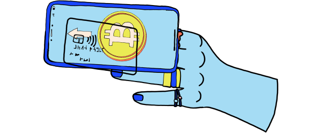
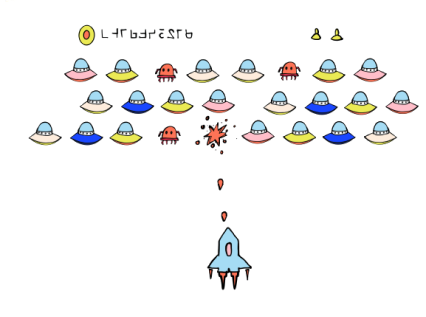

<!-- Page title -->
<column>
<block>
<hero-title>

## What is Secret Network?

</hero-title>
</block>
</column>

<!-- Intro -->
<column class="spacer-s accent-red" number="2" number-s="1" weight="left">
<block>

###### What is Secret Network?

#### A blockchain-based, open-source protocol that lets anyone perform computations on encrypted data, bringing privacy to smart contracts and public blockchains.

By supporting encrypted inputs, encrypted outputs, and encrypted state for smart contracts, Secret Network allows for new kinds of powerful decentralized applications to be built. This can unlock substantial value across multiple verticals and industries, including the following:

</block>

<block>

</block>

</column>

<!-- Industries -->
<column class="spacer-s" number="3" number-m="1" number-s="1">
<block>

<card-minimal class="accent-green">

#### Decentralized  Finance

Support for privacy-preserving asset transfers, lending, and more.

</card-minimal>

</block>

<block>

<card-minimal class="accent-green">

#### Data  Sharing

Sharing and monetizing data while keeping it secure.

</card-minimal>

</block>

<block>

<card-minimal class="accent-green">

#### Machine  Learning

Discovering powerful insights while protecting underlying data.

</card-minimal>

</block>

<block>

<card-minimal class="accent-green">

#### Gaming  Industry

Enabling more open and more usable gaming experiences.

</card-minimal>

</block>

<block>

<card-minimal class="accent-green">

#### Healthcare  Industry

Allowing research over encrypted data, driving innovation.

</card-minimal>

</block>

<block>

<card-minimal class="no-bg">

#### Want to know some other secret keys?

<btn>Read the FAQ</btn>

</card-minimal>

</block>

</column>

<!-- separator -->
<column>
<block>

</block>
</column>

<!-- How Secret Network Operates -->
<column class="spacer-s" weight="right" number="2" number-m="1" number-s="1">

<block>

</block>

<block>

### How Secret Network Operates

The Secret Network is a decentralized network of computers (secret nodes) that utilize trusted execution environments (TEEs) to enable secure, private computation over encrypted data. TEEs function like a “black box” for data processing, and they are utilized in all types of everyday platforms such as smartphones and video game consoles.

The Secret Network blockchain is based on Cosmos SDK / Tendermint, meaning the network has its own independent consensus, on-chain governance, and features like slashing and delegation. It is secured by the native coin Secret (SCRT), which must be staked by network validators and is used for transaction fees as well as governance.

Secret Apps - powered by “secret”, privacy-preserving smart contracts - are built with CosmWasm smart contracts that are written in the Rust programming language and deployed on the Secret Network.

</block>

</column>

<!-- separator -->
<column>
<block>

</block>
</column>

<!-- Block Header -->
<column number="2" number-m="1" number-s="1">

<block>

### Network Flow

The following process describes, step by step, how a contract is submitted and a computation performed on the Secret Network:

</block>

</column>

<!-- Network Flow -->
<column class="spacer-s" number="4" number-m="1" number-s="1">

<block>

<card-minimal class="accent-orange icon-next">

#### 01
#### Writing

A developer writes "secret" smart contracts and deploys them to the Secret Network.

</card-minimal>

</block>

<block>

<card-minimal class="accent-blue icon-next">

#### 02
#### Submission

Users submit encrypted data to Secret Network that can’t be read by anyone else — including the node doing the computation.

</card-minimal>

</block>

<block>

<card-minimal class="accent-yellow icon-next">

#### 03
#### Computation

A "secret node" in the network performs the computation, and returns the result.

</card-minimal>

</block>

<block>

<card-minimal class="accent-red">

#### 04
#### Verification

The work is verified as correct, and payment is released to the secret node that performed the work.

</card-minimal>

</block>

</column>

<!-- Block Header -->
<column>

<block>

### About Our Values

The Secret Network community is dedicated to building privacy-first solutions and applications for the benefit of all, because we believe that privacy is a public good. Here are our primary values.

</block>

</column>

<!-- Values -->
<column class="spacer-s" number="3" number-m="1" number-s="1">

<block>

<card-minimal class="accent-green">

#### Usability and Sustainability

We focus on usability of our network and applications to create meaningful value that is sustainable for the long-term.

</card-minimal>

</block>

<block>

<card-minimal class="accent-green">

#### Optimze for Impact

We prioritize adoption - applications that will make the greatest difference for the most people.

</card-minimal>

</block>

<block>

<card-minimal class="accent-green">

#### Individual Empowerment

Individuals have a right to their own privacy, their own self-expression, and their own data.

</card-minimal>

</block>

</column>

<!-- separator -->
<column>
<block>

</block>
</column>

<!-- block header -->
<column>

<block>

### FAQ

</block>

</column>

<!-- FAQ -->
<column>

<block>

<faq></faq>

</block>

</column>

<!-- <column>

<block>

<secret-agents></secret-agents>

</block>

</column> -->