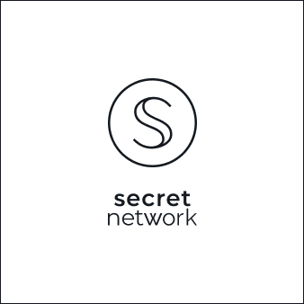
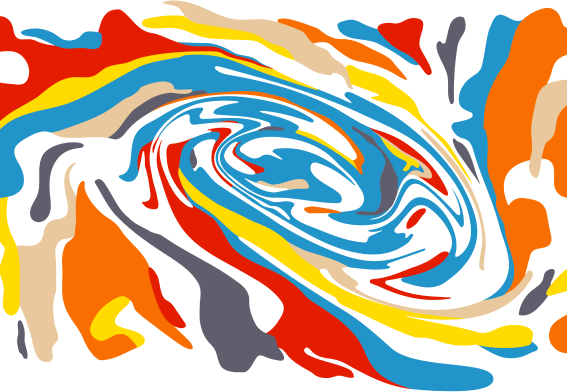
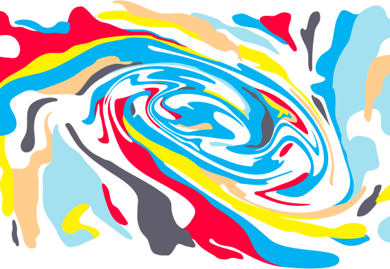
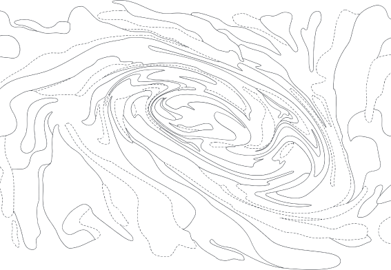
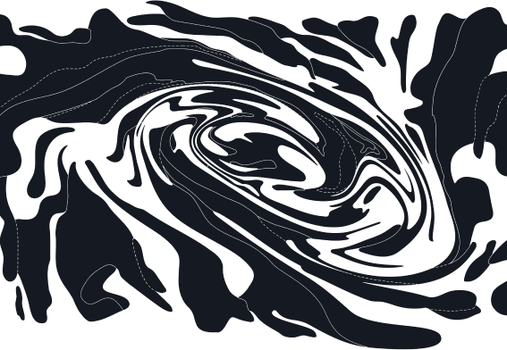

<!-- Page title -->
<column mode="normal">
<block>
<hero-title>

## Secret Brand

</hero-title>
</block>
</column>

<!-- content -->
<column class="spacer-s" number="2" number-m="2" number-s="1">

<block>

### Mission Statement

We build groundbreaking privacy technologies with a focus on increasing usability and adoption. We empower our own community to contribute directly to the success of our network and its applications, and we enable them to directly benefit from its growth. We are passionate and inclusive. We maintain a global presence. We work hard towards driving usage and awareness. We educate and cultivate our community. We build relationships and partnerships across the world so that people everywhere can benefit from privacy.

</block>

<block>

#### Vision Statement

By solving for data privacy, Secret Network will become a foundational pillar of a more decentralized, more democratic, and more empowering internet.
Providing privacy and protecting data is critical for empowering people, protecting their freedoms, and unlocking value for users all around the world. We strive to build a sustainable network, ecosystem, and community that will work towards global adoption of our technologies.

</block>

</column>

<!-- our visual brand is... -->
<column class="spacer-s text-center color-change">

<block>

## Our Visual Brand is <typical :steps="['Humanist', 2000, 'Organic', 2000, 'Illustrated', 2000, 'Flowing', 2000, 'Striking', 2000]" :loop="Infinity" :wrapper="'span'"></typical>.

</block>

</column>

<type title="Hero">

## Secret Brand

</type>

<type title="Content">

### Mission Statement

We build groundbreaking privacy technologies with a focus on increasing usability and adoption. We empower our own community to contribute directly to the success of our network and its applications, and we enable them to directly benefit from its growth. We are passionate and inclusive. We maintain a global presence. We work hard towards driving usage and awareness. We educate and cultivate our community. We build relationships and partnerships across the world so that people everywhere can benefit from privacy.

### Vision Statement

By solving for data privacy, Secret Network will become a foundational pillar of a more decentralized, more democratic, and more empowering internet.
Providing privacy and protecting data is critical for empowering people, protecting their freedoms, and unlocking value for users all around the world. We strive to build a sustainable network, ecosystem, and community that will work towards global adoption of our technologies.

### Our visual brand is
humanist
organic
illustrated
flowing
striking

[Download our Brandbook](/SecretNetwork_BrandBook_Version01.pdf)

## Logo

### Icon

<g-image src="../src/assets/logo-seal-outline-black.svg"></g-image>

<g-image src="../src/assets/logo-seal-outline-white.svg"></g-image>

The Secret S evokes a flowing network and the duality of secrets: **privacy** and **transparency**.

The ends of the S are open, allowing data to freely flow in and out.
The interior of the S is private, an enclave that encloses the activity of the network itself.

The overall shape of the S is reminiscent of a yin-yang, again reflecting the duality of a privacy-preserving network — a deeply humanist technology.

### Primary Logo

<a href="/secretnetwork-logo-primary-black.svg">SVG</a>
<a href="/secretnetwork-logo-primary-black.png">PNG</a>

<a href="/secretnetwork-logo-primary-white.svg">SVG</a>
<a href="/secretnetwork-logo-primary-white.png">PNG</a>

### Secondary Logo

<a href="/secretnetwork-logo-secondary-black.svg">SVG</a>
<a href="/secretnetwork-logo-secondary-black.png">PNG</a>

<a href="/secretnetwork-logo-secondary-white.svg">SVG</a>
<a href="/secretnetwork-logo-secondary-white.png">PNG</a>

## Typography

# Heading 1 Montserrat Bold (700)

## Heading 2

### Heading 3

#### Heading 4

Hind Regular (400) is used body copy, and **Hind Bold (700) is used for bold body copy, buttons and alerts.**

## Paint Swirl

### Analog Colors

<a href="/analog.svg">SVG</a>
<a href="/analog.png">PNG</a>

### High Key Colors

<a href="/high-key.svg">SVG</a>
<a href="/high-key.png">PNG</a>

### Topographical Map

<a href="/topographical-white.svg">SVG</a>
<a href="/topographical-white.png">PNG</a>

<a href="/topographical-black.svg">SVG</a>
<a href="/topographical-black.png">PNG</a>

## Analog Colors

### Primary

class="black" hex="#151A20" rgb="rgb(21, 26, 32)"

class="white" hex="#FFFFFF" rgb="rgb(255, 255, 255)"

### Secondary

hex="#5F5F6B" rgb="rgb(95, 95, 107)"

hex="#816DA8" rgb="rgb(129, 109, 168)"

hex="#D53A2C" rgb="rgb(213, 58, 44)"

hex="#EA7534" rgb="rgb(234, 117, 52)"

hex="#E5C7A3" rgb="rgb(229, 199, 163)"

hex="#FFD72E" rgb="rgb(255, 215, 46)"

hex="#5AA361" rgb="rgb(90, 163, 97)"

hex="#3EB7AC" rgb="rgb(62, 183, 172)"

hex="#4195C4" rgb="rgb(65, 149, 196)"

### Tertiary

hex="#BCBCCC" rgb="rgb(188, 188, 204)"

hex="#D2BEED" rgb="rgb(210, 190, 237)"

hex="#EF726C" rgb="rgb(239, 114, 108)"

hex="#FFAA88" rgb="rgb(255, 170, 136)"

hex="#FFE6D2" rgb="rgb(255, 230, 210)"

hex="#FFEB97" rgb="rgb(255, 235, 151)"

hex="#B1D8A3" rgb="rgb(177, 216, 163)"

hex="#9AE8DA" rgb="rgb(154, 232, 218)"

hex="#8FD2EA" rgb="rgb(143, 210, 234)"

## High Key Colors

### Primary

class="black" hex="#151A20" rgb="rgb(21, 26, 32)"

class="white" hex="#FFFFFF" rgb="rgb(255, 255, 255)"

### Secondary

hex="#5F5F6B" rgb="rgb(95, 95, 107)"

hex="#7A5CD6" rgb="rgb(122, 92, 214)"

hex="#FF144E" rgb="rgb(255, 20, 78)"

hex="#FF6510" rgb="rgb(255, 101, 16)"

hex="#FFCE99" rgb="rgb(255, 206, 153)"

hex="#FFEC00" rgb="rgb(255, 236, 0)"

hex="#25A02B" rgb="rgb(37, 160, 43)"

hex="#00DDBE" rgb="rgb(0, 221, 190)"

hex="#00B3EA" rgb="rgb(0, 179, 234)"

### Tertiary

hex="#BCBCCC" rgb="rgb(188, 188, 204)"

hex="#D2BEED" rgb="rgb(210, 190, 237)"

hex="#EF726C" rgb="rgb(239, 114, 108)"

hex="#FFAA88" rgb="rgb(255, 170, 136)"

hex="#FFE6D2" rgb="rgb(255, 230, 210)"

hex="#FFEB97" rgb="rgb(255, 235, 151)"

hex="#B1D8A3" rgb="rgb(177, 216, 163)"

hex="#9AE8DA" rgb="rgb(154, 232, 218)"

hex="#AEE0ED" rgb="rgb(174, 224, 237)"

</type>

