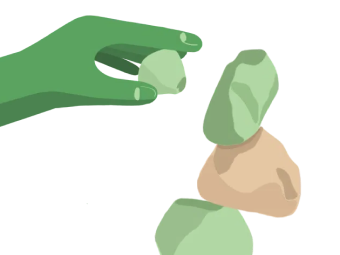

<!-- Tools -->
<column class="spacer-s bg-black-gradient">

<block>

<card-grid-v2 header="Tools" title="Tools" collection="toolsAndWallets" :isPaginated="false"></card-grid-v2>

</block>

</column>

<column number="2" number-m="1" number-s="1" weight="left" class="ecosystem-pages ecosystem-pages__roadmap">

<block>

## See what Secrets we have in store

</block>

<block class="ecosystem-pages ecosystem-pages__action">

<btn class="text-center no-arrow" url="/ecosystem/ecosystem-roadmap">View Roadmap</btn>

</block>

</column>

<column class="ecosystem-pages ecosystem-pages__two-columns" number="2" number-s="1" weight="right">

<block class="ecosystem-pages__two-columns__img">

</block>

<block>

### Build (more) with privacy

Use Secret’s private-by-default smart contracts to develop trailblazing apps not possible elsewhere.

<btn class="text-center no-arrow" url="/developers">VIEW DEV TOOLS</btn>

</block>

</column>

<column class="ecosystem-pages ecosystem-pages__two-columns" number="2" number-s="1" weight="left">

<block>

### Start using the network

Find out where to buy SCRT, what wallet to store it in, and how to start using Secret dApps. 

<btn class="text-center no-arrow" url="/about/about-scrt">Get SCRT</btn>

</block>

<block class="ecosystem-pages__two-columns__img">

</block>

</column>