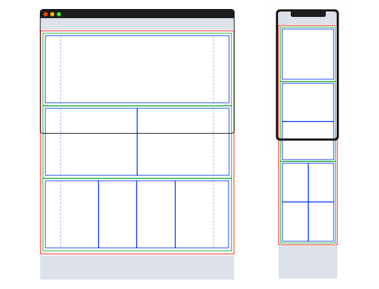

<!-- Hero -->
# Welcome to Flare

<columns number="2" number-s="1">

Flare is a design system for front-end agile engineering.

Flare describes any application front-end using four simple concepts: layouts, pages, frames and blocks. This abstraction layer shapes a common language between definition and implementation teams.

With Flare, analysts, designers and stakeholders can prototype a full-blown application in seconds sharing wireframes, mock-ups or code with coders and testers in a continuous cycle for a true agile experience.

<block>

</block>

</columns>

<!-- Components -->

<columns number="4" number-m="2" number-s="2">

<block>

### Layouts

Layouts decorate the pages.

Learn more

</block>

<block>

### Pages

Pages are the central entity, they organize the frames.

Learn more

</block>

<block>

### Frames

Frames support the blocks.

Learn more

</block>

<block>

### Blocks

Blocks are the actual content.

Learn more

</block>

</columns>

Flare is a paradigm that breaks down digital content into layouts, pages, frames and blocks

<columns number="3" number-s="1">

<block class="red-box">

## Boxed red

Nulla a lectus dictum, iaculis arcu quis, porttitor lorem. Ut ultrices tincidunt congue. Vestibulum et est fringilla, consectetur lacus quis.

</block>

<block class="green-box">

## Boxed green

Lorem ipsum dolor sit amet, consectetur adipiscing elit. Sed vestibulum efficitur ultrices. Donec ac sem risus. Praesent vitae lectus velit.

</block>

<block class="blue-box">

## Boxed blue

Pellentesque sit amet odio semper, suscipit enim vel, molestie metus. Praesent ullamcorper facilisis lacus, ultricies efficitur nisl laoreet id. Suspendisse.

</block>

</columns>