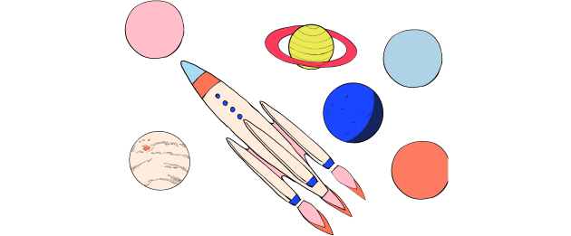

<!-- Hero Video -->
<column class="card-variant" mode="normal">
<block>

<hero-video />

</block>
</column>

<!-- Getting started -->

<column>

<block>

<card-simple class="orientation-horizontal accent-purple" url="/ecosystem/overview">

<card-block>

### Getting started

#### with Secret Network

Get SCRT, install a Wallet, explore Secret DeFi, become a Secret Agent. 

</card-block>

<card-block>

</card-block>

</card-simple>

</block>

</column>

<!-- Card collection -->
<column class="spacer-s" number="3" number-m="1" number-s="1">

<block>

<card-simple class="orientation-vertical accent-orange" url="/about/about-secret-network">

<card-block>

### Learn

#### about Secret Network

Find out why Secret Network is a first-of-its-kind, open-source blockchain that provides data privacy by default.

</card-block>

<card-block>

</card-block>

</card-simple>

</block>

<block>

<card-simple class="orientation-vertical accent-green" url="/developers">

<card-block>

### Build

#### on Secret Network

Use Secret Contracts to build decentralized applications with improved usability and explore new frontiers in web3.

</card-block>

<card-block>

</card-block>

</card-simple>

</block>

<block>

<card-simple class="orientation-vertical accent-blue" url="/community">

<card-block>

### Join

#### the Community

Whether you’re a developer, an artist, a writer, an entrepreneur, or a dreamer, there are many ways for you to contribute to Secret Network.

</card-block>

<card-block>

</card-block>

</card-simple>

</block>

</column>

<!-- Want to build better internet title -->
<column class="home--build_better_internet" number="2" number-m="1" number-s="1">

<block>

# Want to build a better internet?

</block>

</column>

<!-- Want to build better internet paragraphs -->
<column class="spacer-s" number="2" number-m="1" number-s="1">

<block>

Secret Network is the first blockchain with privacy-preserving smart contracts. That means applications built on Secret can utilize encrypted data without revealing it to anyone, even the nodes in the network. For the first time, Secret Network allows developers to build powerful, permissionless, privacy-preserving applications - Secret Apps.

</block>

<block>

Blockchains are public by default. That means that all the data used in smart contracts is exposed to everyone. For blockchain technology to achieve global adoption, users and organizations need control over how their data is used – they can’t just expose it to everyone. Secret Network solves the problem of privacy, helping to secure and scale the decentralized web.

</block>

</column>

<!-- Solves for privacy -->
<column class="spacer-s color-change">

<block>

### Secret Solves for <typical class="color-change" :steps="['Privacy', 2000, 'Usability', 2000, 'People', 2000, 'Security', 2000, 'Sustainability', 2000]" :loop="Infinity" :wrapper="'span'"></typical>.

</block>

</column>

<!-- Announcement -->
<column class="announcement accent-green spacer-s" weight="left" number="2" number-s="1">

<block>

#### Announcement

### SCRT 2020: Our Secret Vision for Universal Finance

Learn about some of the critical applications being built on Secret Network - and how you can get involved. Help us drive adoption of decentralized finance with security, privacy, and fairness!

<btn>Read more</btn>

</block>

</column>

<!-- Block header -->
<column class="block-header" number="2" number-m="1" number-s="1">

<block>

### Latest Blog Posts
  
Read, watch and absorb the secrets that we publish in our official blog.

</block>

<block>

<btn url="/blog/">Unveil more secrets</btn>

</block>

</column>

<!-- Blog cards -->
<column class="spacer-s">

<blog-latest-posts class="latest-blog-cards"></blog-latest-posts>

</column>

<!-- Announcement -->
<column class="announcement accent-green spacer-s" weight="right" number="2" number-m="1" number-s="1">

<block>

#### Announcement

### SecretSwap is LIVE!

Secret #DeFi is here. Now you can trade secret tokens with frontrunning resistance, improved privacy protections, and low cost. Start using SecretSwap now and stay tuned for more info on next step, a native governance token for Secret DeFi, and more rewards.

<btn url="/blog/secretswap-is-live-on-mainnet">Read more</btn> <btn url="https://bridge.scrt.network/swap#Swap">Try It Out!</btn>

</block>

<block>

</block>

</column>

<!-- Block header -->
<column class="block-header" number="2" number-s="1">

<block>

### Latest Media Articles

</block>

<block>

<btn url="/media/features">Unveil more secrets</btn>

</block>

</column>

<!-- Podcasts -->
<column class="spacer-s" number="3" number-s="1">

<block>

<card-media class="accent-red"  url="https://www.youtube.com/watch?v=Kx9hb3U7pfs">

Podcast

###### Private Smart Contracts: Anthony Pompliano

</card-media>

</block>

<block>

<card-media class="accent-red" url="https://anchor.fm/thedefiant/episodes/Privacy-Might-be-the-Only-Thing-Left-That-Makes-Web-3-0-a-Viable-Alternative-Tor-Bair-of-Secret-Foundation-el9n52">

Podcast

###### Secret Network on The Defiant Podcast

</card-media>

</block>

<block>

<card-media class="accent-red" url="https://www.crowdcast.io/e/zkp-privacy-summit/5">

Podcast

###### zkp-privacy Summit: Secret Contracts

</card-media>

</block>

</column>