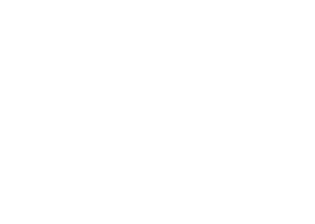

<hero-mixed bg-color="#7A5CD6" bg-image="https://ik.imagekit.io/secretnetwork/images/Market_a2a48fa0a9_xM8ldfIFG.jpg">

<template v-slot:title>

###### Documentation

### Project structure

</template>

<template v-slot:body>

- A global, open alternative to the current financial system.
- Products that let you borrow, save, invest, trade, and more.
- Based on open-source technology that anyone can program with.

</template>

</hero-mixed>

<content-navigator-docs>

### Project structure

This is the folder structure we currently have.

```text
.
├── package.json
├── gridsome.config.js
├── static/
├── content/
├── data/
├── docs/
├── .env
└── src/
```

> This project uses [Gridsome.org](https://gridsome.org/docs/)

---

### Configuration files

#### gridsome.config.js

In this config file we have all the configuration for gridsome, as you can seen in the [Secret Network Data Diagram](#data-diagram) we have some information in 2 folders `content/` and `docs/`, in this gridsome.config.js is where we determinated which folders are going to be used.

#### data/

This contains a `settings.json` wich is use for the sidebar of this Documentation

---

### Content Folders

#### static/

In this folder is static files such as `images`, those that can be optimazed for Gridsome.

#### content/

This folder contains all the `.md` for Secret Network content

#### docs/

This folder contains all the `.md` for this documentation

---

### Source

Here is we're magic happens. What `src/` structure looks like:

```text

└── src/
    ├── assets/
    ├── components/
    ├── config/
    ├── layouts/
    ├── pages/
    ├── templates/
    ├── sass/
    ├── main.js
    └── index.html

```

In `assets/` we save all icons,images,logos that are use in templates and layouts.

The `components/` folder contains all shared Vue components.

`Config/` only has a `open-graph.js` file with metadata that is use in `main.js`.

`layout/` where the different layouts live (`Default` and `Docs`) layouts.

`Pages/` has Blog.vue and 404.vue pages for specific purposes.

`Templates/` store the different templates such as `Blog.vue` feed from our diferent endpoints.

`sass/` where styles live.

---

#### Data Diagram



All the content of Secret Network is coming from differents ends.

- `Strapi`
- `Ghost`
- `Content/` ~ here we have stored all the files for the Secret Network content
- `Docs/` ~ where this documentation live

</content-navigator-docs>
